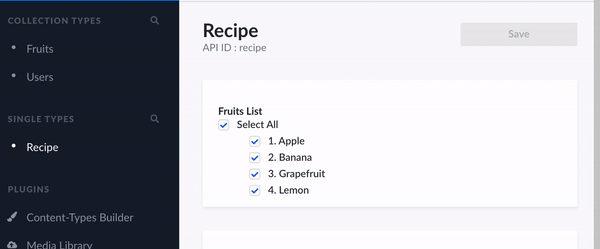

# Strapi application with custom fields

Repository with completed example of custom fields' creation in Strapi (v 3.6.5).

> Please note that the solution presented here may differ in older releases. However, the workflow for them is very similar - after following [this tutorial](medium.com), you will easily be able to find a solution that fits your version and needs.
